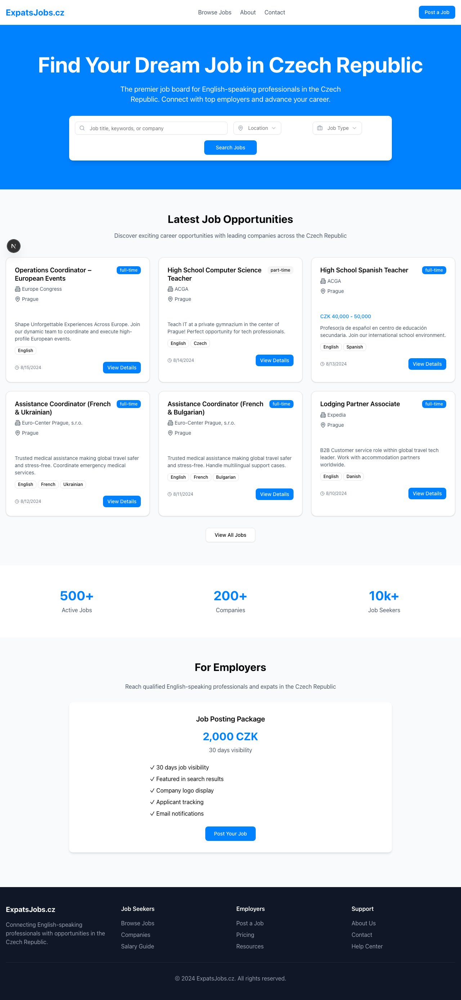

# ExpatsJobs.cz

A modern job board platform designed for English-speaking professionals in the Czech Republic. Built with Next.js, TypeScript, Tailwind CSS, and shadcn/ui.

🌐 **Live Demo**: [expatsjobs-a6zhy7t7c-future-developments.vercel.app](https://expatsjobs-a6zhy7t7c-future-developments.vercel.app)



## Features

- 🎯 **Job Listings**: Browse and search through job opportunities
- 💼 **Post Jobs**: Employers can post jobs for 2,000 CZK / 30 days
- 🔍 **Advanced Search**: Filter by location, job type, and keywords
- 💳 **Stripe Integration**: Secure payment processing
- 📱 **Responsive Design**: Works perfectly on all devices
- 🎨 **Modern UI**: Clean design with shadcn/ui components
- ⚡ **Fast Performance**: Built with Next.js and Turbopack

## Tech Stack

- **Framework**: Next.js 15 with App Router
- **Language**: TypeScript
- **Styling**: Tailwind CSS
- **UI Components**: shadcn/ui
- **Database**: Neon PostgreSQL (recommended)
- **Payments**: Stripe
- **File Storage**: Vercel Blob (for company logos)
- **Deployment**: Vercel

## Getting Started

### Prerequisites

- Node.js 18+ 
- npm or yarn
- PostgreSQL database (Neon recommended)
- Stripe account

### Installation

1. **Clone the repository**
   ```bash
   git clone <repository-url>
   cd expatsjobs
   ```

2. **Install dependencies**
   ```bash
   npm install
   ```

3. **Set up environment variables**
   ```bash
   cp .env.example .env.local
   ```
   
   Fill in your environment variables:
   - Database URL (Neon PostgreSQL)
   - Stripe keys
   - Other configuration

4. **Set up the database**
   ```bash
   # Run the SQL schema file in your Neon database
   psql $DATABASE_URL -f database/schema.sql
   ```

5. **Start the development server**
   ```bash
   npm run dev
   ```

   The application will be available at `http://localhost:4000`

## Database Setup with Neon

1. Create a new project at [neon.tech](https://neon.tech)
2. Copy your connection string
3. Run the schema file: `database/schema.sql`
4. Update your `.env.local` with the DATABASE_URL

## Stripe Setup

1. Create a Stripe account at [stripe.com](https://stripe.com)
2. Get your API keys from the Dashboard
3. Set up webhooks for payment confirmation
4. Add keys to your `.env.local`

## File Storage Setup (Vercel Blob)

1. **In your Vercel dashboard:**
   - Go to Storage tab
   - Create a new Blob store
   - Copy the `BLOB_READ_WRITE_TOKEN`

2. **Add to environment variables:**
   ```
   BLOB_READ_WRITE_TOKEN="vercel_blob_rw_your_token_here"
   ```

3. **File storage features:**
   - **CVs**: PDF, DOC, DOCX (max 5MB)
   - **Company logos**: JPG, PNG, GIF, WebP, SVG (max 2MB)
   - **Automatic CDN delivery** for fast loading
   - **Secure uploads** with user authentication

## Deployment on Vercel

1. **Connect to Vercel**
   ```bash
   npm install -g vercel
   vercel login
   vercel
   ```

2. **Add environment variables** in Vercel dashboard
3. **Connect your Neon database** 
4. **Set up custom domain** (expatsjobs.cz)

## Project Structure

```
src/
├── app/                    # Next.js app router pages
│   ├── jobs/              # Job listings and details
│   ├── post-job/          # Job posting form
│   └── page.tsx           # Homepage
├── components/            # Reusable components
│   ├── ui/               # shadcn/ui components
│   ├── JobCard.tsx       # Job listing card
│   └── SearchForm.tsx    # Search functionality
├── lib/                  # Utilities and configurations
│   └── mockJobs.ts       # Sample job data
└── database/             # Database schema
    └── schema.sql        # PostgreSQL schema
```

## Key Features Implementation

### Job Posting Flow
1. Employer fills job posting form
2. Payment processed via Stripe (2,000 CZK)
3. Job goes live for 30 days
4. Email notifications sent

### Search & Filtering
- Keyword search across title, company, description
- Location filtering (Prague, Brno, etc.)
- Job type filtering (full-time, part-time, contract)
- Real-time results

### Payment Processing
- Secure Stripe integration
- 2,000 CZK for 30-day job posting
- Automatic job activation after payment
- Invoice generation

## Contributing

1. Fork the repository
2. Create a feature branch
3. Make your changes
4. Add tests if applicable
5. Submit a pull request

## License

This project is licensed under the MIT License.

## Support

For support, email support@expatsjobs.cz or create an issue in the repository.

---

Built with ❤️ for the expat community in Czech Republic.
